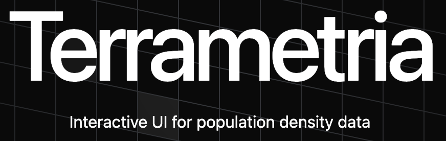
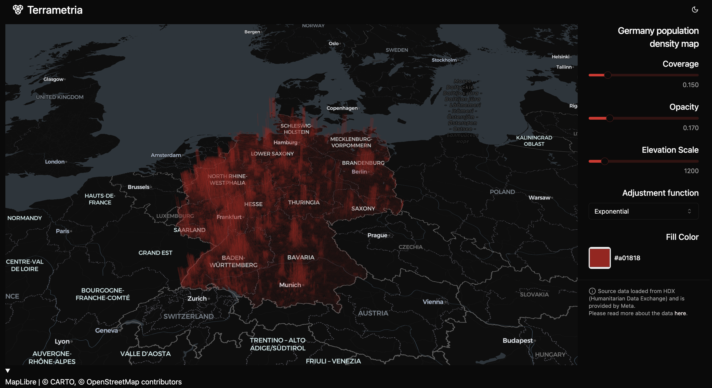

# Terrametria - 3D population density map

This project shows an example of interactive 3d density map, with data processed by Databricks and deployed as a Databricks App.

> Source data loaded from HDX (Humanitarian Data Exchange) and is provided by Meta.
Please read more about the data [here](https://dataforgood.facebook.com/dfg/docs/high-resolution-population-density-maps-demographic-estimates-documentation).

<p align="center">
    
</p>

## Local development

Prerequisites:
- Python 3.9+
- Hatch
- Node.js 20.0+
- Databricks CLI
- Databricks workspace

1. Clone the repository
2. Setup the Python env for backend:
```
hatch env create
```
3. Setup frontend:
```
yarn --cwd src/frontend install
```

First, deploy and run the workflow:
```bash
databricks bundle deploy --var="catalog=main" --var="schema=terrametria"
databricks bundle run terrametria
```

Note the catalog and schema name. You will need it to run the app. Grant access to this catalog and schema to the principal that you will use to run the app.

Then, configure your environment variables in `.env` file:
```bash
# client/secret id for a principal that has access to the
DATABRICKS_CLIENT_ID=
DATABRICKS_CLIENT_SECRET=
# Databricks workspace URL, without HTTP/HTTPS prefix
DATABRICKS_HOST=
DATABRICKS_SQL_WAREHOUSE_ID=
# catalog and schema name from the previous step
TERRAMETRIA_CATALOG=
TERRAMETRIA_SCHEMA=
```

Now open 2 terminals and run the following commands:

```bash
# Terminal 1
> hatch run dev-frontend
# Terminal 2
> hatch run dev-backend
```

Go to [`http://localhost:5173`](http://localhost:5173/) to see the app in action.

## Deployment 

To deploy the app, login to your Databricks workspace from Databricks CLI:
```bash
databricks auth login 
```

Then, run the following command:
```bash
./deploy-app.sh <app-name> <Workspace-FS-dir-for-app-files>
```

For example:
```bash
./deploy-app.sh terrametria /Workspace/Users/${MY_DATABRICKS_USERNAME}/apps/terrametria
```

During the App deployment, another service principal will be created. Make sure to grant access to the catalog and schema to this principal.
After the app deployment, add a SQL warehouse to the app resources via UI. Give it a key `sql_warehouse`. The value should be the ID of the SQL warehouse that you want to use for the app.


## Example 



## Tech used

- Frontend:
  - [React](https://react.dev/)
  - [TypeScript](https://www.typescriptlang.org/)
  - [Vite](https://vite.dev/)
  - [Deck.gl](https://deck.gl/)
- Backend:
  - [FastAPI](https://fastapi.tiangolo.com/)
  - [Databricks Apps](https://docs.databricks.com/en/dev-tools/databricks-apps/index.html)
  - [Databricks SQL](https://www.databricks.com/product/databricks-sql)
